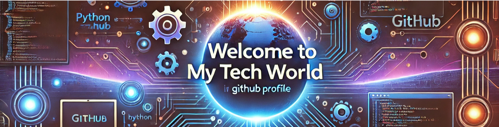

### :wave: Hello, I'm Gurpreet!

I am a passionate **software developer** with a strong interest in building innovative, user-friendly, and efficient applications. My journey in technology began with curiosity about how systems work, and today, it has evolved into a deep commitment to learning, solving problems, and contributing to impactful projects. With a knack for creative challenges and a meticulous eye for detail, I strive to bring ideas to life through clean code and thoughtful design.

---

In addition to coding, I am:
- **An avid learner**: I constantly seek new tools, languages, and frameworks to broaden my expertise.
- **Curious and growth-oriented**: Always looking for opportunities to expand my knowledge and skills.
- **Nature-inspired**: Beyond the screen, I find joy in nature, which helps me stay grounded and enhances my problem-solving approach.
- **Focused on impact**: I aim to create solutions that make a difference in the world, one line of code at a time.
---

## :wrench: My ToolBox
     
   

---

  -->

---

## :bar_chart: GitHub Stats

---

## :handshake: Let's Connect
-   

---

### 🌱 Fun Fact:
> "Nature brings clarity, and clarity brings solutions."

---
##### Thank you for visiting my profile! :smile:
